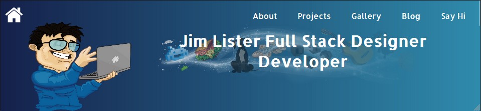
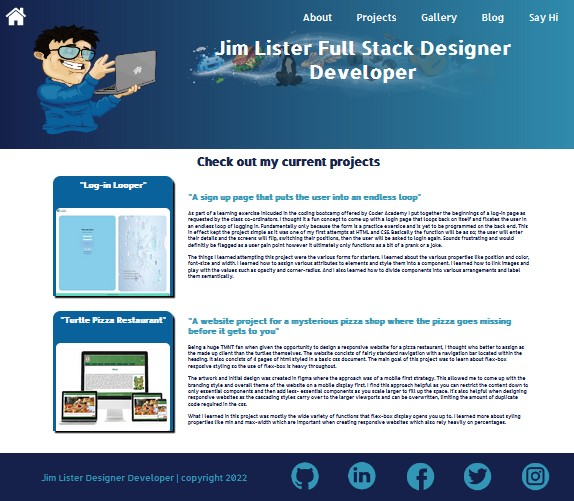
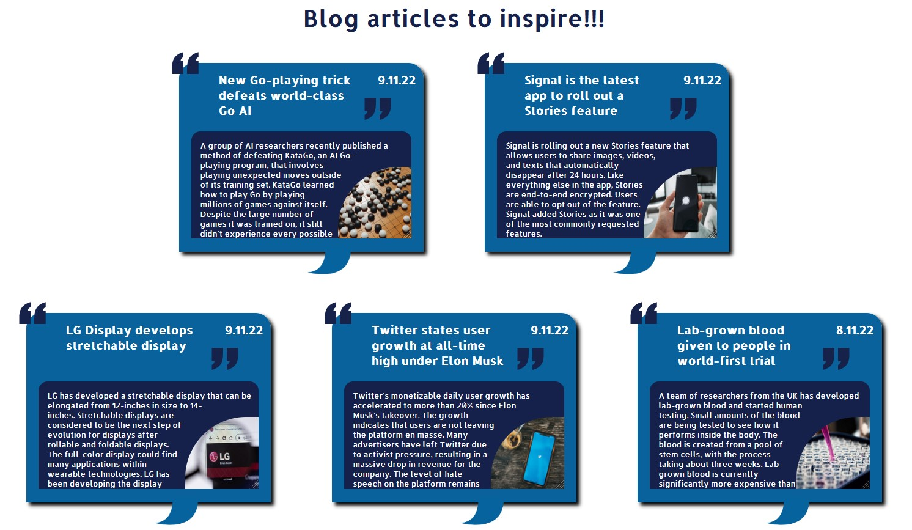
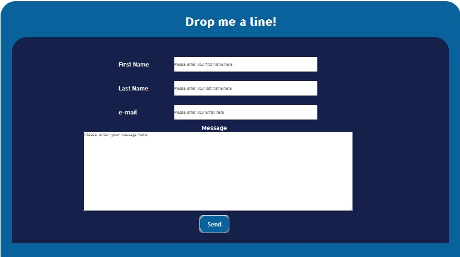

# 
 Jim-Lister-Portfolio-Website 

### <a href = "https://jim-lister-website-portfolio.netlify.app/">Link to Website - https://jim-lister-website-portfolio.netlify.app/</a>

### <a href ="https://github.com/JamJuiceCreative/Jim-Lister-Portfolio-Website">Link to Git Hub Repo - https://github.com/JamJuiceCreative/Jim-Lister-Portfolio-Website</a>

### <a href ="/"> Link to presentation video - </a>

# 
 Purpose 

This portfolio is ultimatly going to be my go to website for showcasing my development projects to prospective employers. It's going to be the place where I can present myself as a developer as opposed to a graphic designer however I plan to include some graphic design portfolio elements in the future. I have attempted to make the design very me in that it includes some illustration as part of the design and an over all theme that I'm really happy with ie; a clean and elegant layout. I have also included a small section regarding my hobbies and interests as it's also important to find common interests with potential work colleagues and employers. 

My main goal is to side step away from graphic design & sign making and move into a more technical field such as software development. Hopefully by the end of the course this website will be an invaluable tool in doing so.

# 
 Functionality/ Features

## Navigation

My website has a fully functional navigation and is fully responsive on any media screen display. I have utilised flex-box and media queries in order to achieve this. The code is fully semantic with comments making the website fully accessible as well as the code, easy to navigate for another dev. The internal navigation always leads somewhere and there are no edge cases or user pain points. 

## Header
|          Header Full Screen         |   Header Tablet   | Header Phone |
:------------------------------------:|:-----------------:|:------------:|
  ||

The site includes a header that contains a responsive navigation bar which responds to the browser width. I have used media queries deliberatly here in order to control how the navigation will appear accross various different media platforms. The navigation bars are fully functional and are created from styled un-ordered lists. 

## Footer

|          Footer Full Screen         |  Footer Phone |
:------------------------------------:|:------------:
 | 

The sites footer contains functioning links to my external social media and professional platforms. The footer is also fully responsive and looks good on any device.

## About Section/ Home Page

|          Home Page Full Screen      | 
:------------------------------------:|

|          Home Page Tablet         |  Home Page Phone |
:------------------------------------:|:------------:
 | 

I have utilised my about section and included it on my landing page. The about section concists of a couple of different components that I have labeled as "cards". The cards show my skills (and skills to come) as well as the resume card is a link to a pdf of my resume. The cards themselves concist of responsive elements in flex-box and are affected by any changes in the viewport. The rest of the information is arranged in such away that it snaps and wraps around as the browser window is atered using flex-wrap as-well as percentages and min-widths on the elements' containers.

## Projects

The projects section consists of a couple of examples of dev work I have completed as a part of doing this course. I've essentially the displayed the projects as static images in similar components as "cards", these are called "project-cards" with some descriptive text situated in a container with over-flow text set to scroll.

## Gallery

The gallery section right now is a place holder which I intend to utilise in the future to showcase my graphic design port-folio. Right now it consists of two of the "card" elements "Gallery Cards" which house some images. These cards are responsive like the rest of the website. 

## Blog

The blog section consists of a list of 5 blog posts contained in a component called "blog-box". The idea is to have some what of a speech bubble with the blog post title contained between some quotation marks. I've utilized some SVG elements to achieve this. The blog posts all link to their corresponding external blog however the component itself contains some sample text from the blog as well as an image that the aformentioned text wraps around. The components themselves are situated in a flex-box and they will wrap and stack as the display shrinks.

## Contact/ Say Hi

The contact section concists of a form containing elements such as text inputs and email inputs. There is also a submit button. Everything is styled based on the websites overall theme however the form doesn't function further than allowing for the text input. This will come later as we progress through the course and start to learn more of the back end. The form is however fully responsive and all of the elements stretch and stack depending on the browser width.

# 
 Site Map </a>

# 
 Target Audience 

The target audience is first and formostly going to be potential employers. My hopes are that it can also reach recruiters, potential work colleagues and just generally members of the tech/ dev community. Once I have completed the course, the website will showcase my technical abilities in the areas of web development, IT and software development which is my desire as I would like to side step away from graphic design and impress the type of employer seeking someone with more of the skills associated with full stack web and software development.

# 
 Tech Stack 

* __HTML__ 
* __CSS__
* __SASS__
* __VISUAL STUDIO CODE__
* __TERMINAL__
* __GITHUB__
* __NETLIFY__

# 
 References 

### **Blog Posts taken from TLRD Newletter Tuesday 8th Nov 2022**

## Images for Gallery Place Holder

Web-Design - Photo 76390818 © Rawpixelimages | Dreamstime.com

Graphic-Design - Photo 109828851 © Prathan Chorruangsak | Dreamstime.com

## Images for blog posts 

Signal Post - Photo by <a href="https://unsplash.com/@mbaumi?utm_source=unsplash&utm_medium=referral&utm_content=creditCopyText">Mika Baumeister</a> on <a href="https://unsplash.com/s/photos/signal-app?utm_source=unsplash&utm_medium=referral&utm_content=creditCopyText">Unsplash</a>

Lab Grown Blood Post - Photo by <a href="https://unsplash.com/@_louisreed?utm_source=unsplash&utm_medium=referral&utm_content=creditCopyText">Louis Reed</a> on <a href="https://unsplash.com/s/photos/lab-gorwn-blood?utm_source=unsplash&utm_medium=referral&utm_content=creditCopyText">Unsplash</a>

Go Trick Post - Photo by <a href="https://unsplash.com/@elenapopova?utm_source=unsplash&utm_medium=referral&utm_content=creditCopyText">Elena Popova</a> on <a href="https://unsplash.com/s/photos/go-board-game?utm_source=unsplash&utm_medium=referral&utm_content=creditCopyText">Unsplash</a>

CSS Post  - Photo 172750204 © Transversospinales | Dreamstime.com

Twitter Post - Photo by <a href="https://unsplash.com/@nate_dumlao?utm_source=unsplash&utm_medium=referral&utm_content=creditCopyText">Nathan Dumlao</a> on <a href="https://unsplash.com/s/photos/twitter?utm_source=unsplash&utm_medium=referral&utm_content=creditCopyText">Unsplash</a>
  
## Header Images
Zombie - Illustration 97728166 © Drawkman | Dreamstime.com  
BasketBall- Illustration 94748090 © Dragon_27 | Dreamstime.com
Great-Dane-
Illustration 202093666 © Dima1970 | Dreamstime.com

Illustration 17669622 © Eugenp | Dreamstime.com

Illustration 94261130 © Nadir Gafarov | Dreamstime.com

Social Media Icons - Illustration 132052860 © balloon18 | Dreamstime.com

resume-icon - Illustration 187075464 © hironicons | Dreamstime.com

Graduation Cap Illustration 24622121 © William Fehr | Dreamstime.com

magic swooshes - <a href="https://www.freepik.com/free-vector/magic-flying-lights-glitters-different-abstract-shapes-transparent-realistic_6847254.htm#query=magic%20light&position=0&from_view=keyword">Image by macrovector</a> on Freepik

responsive web design image - Photo 86082648 © Kaspars Grinvalds | Dreamstime.com

